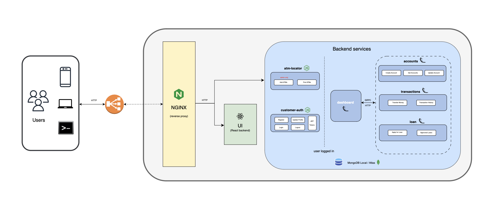

# Martian Bank: Cloud-Native Microservices Demo Application

## 🚀 Descripción General

Martian Bank es una aplicación de demostración de microservicios que simula un banco digital, diseñada para ilustrar prácticas de desarrollo cloud-native y arquitecturas de Kubernetes. La aplicación permite a los clientes gestionar cuentas bancarias, realizar transacciones, localizar cajeros y solicitar préstamos.

**Características clave:**
- Construida con React, Node.js y Python
- Distribuida en contenedores Docker
- Despliegue flexible mediante Helm
- Arquitectura de microservicios completa
- Documentación exhaustiva con Swagger UI
- Capacidades de pruebas de rendimiento y generación de carga
- Integración con otros proyectos de código abierto

## 🎯 Objetivo

Construir un pipeline de CI/CD e implementar la infraestructura necesaria para el despliegue continuo de Martian Bank en un clúster de Kubernetes, asegurando una entrega eficiente y automatizada del software. Este enfoque permitirá:

- Despliegue independiente de servicios por equipos
- Automatización de despliegues tras pasar pruebas de CI
- Implementación de controles de calidad en cada etapa del pipeline
- Capacidad de desplegar nuevas versiones de servicios junto a versiones anteriores

## 🌐 Arquitectura de Microservicios

### Servicios Backend

| **Servicio**       | **Tecnología** | **Descripción**                 |
|---------------------|----------------|---------------------------------|
| `accounts`         | Flask (Python) | Gestión de cuentas bancarias   |
| `atm-locator`      | Node.js        | Localización de cajeros         |
| `customer-auth`    | Node.js        | Autenticación de usuarios       |
| `dashboard`        | Flask (Python) | Panel de control                |
| `loan`             | Flask (Python) | Gestión de préstamos            |
| `transactions`     | Flask (Python) | Procesamiento de transacciones  |

### Componentes Frontend
- **UI**: Aplicación React
- **Nginx**: Reverse proxy para servicios backend y frontend

### Diagrama de la arquitectura

## 📦 Requisitos Previos
- Docker
- Kubernetes (Minikube recomendado)
- Helm
- `kubectl`
- SealedSecrets

## 🔧 Instalación

La instalación de Martian Bank es un proceso flexible que permite despliegues tanto en entornos locales como en la nube. Esta guía detalla los pasos para configurar la aplicación en Minikube y AWS, abarcando desde la creación del cluster hasta el acceso a la aplicación desplegada.
- Características clave de la instalación:
- Configuración de un cluster Kubernetes de 3 nodos
- Despliegue de servicios de monitoreo como Prometheus
- Implementación de seguridad con Sealed Secrets
- Uso de Helm para la gestión de paquetes
- Opciones para despliegue local y en la nube (AWS)

[Guía de Instalación](guia-instalacion.md)

## 🌟 Features

1. Integración Continua (CI)
   - [Configuración y Uso de GitGuardian en Workflows de GitHub Actions](gitguardian-readme.md)
   - [SonarQube](SonarQube-readme.md)
   - [Ejecución de Unit Tests con GitHub Actions](Unit-Test-readme.md)
   - [Construcción y Publicación de Imágenes Docker con GitHub Actions](docker-publish-readme.md)
   - [Configuración y Uso de Semantic Release con GitHub Actions](semantic-release-readme.md)
   - [Configuración y Uso del Job de Linting con GitHub Actions](lint-readme.md)
2. Entrega Continua (CD)
   - [Implementación de ArgoCD para Martian Bank](argocd-readme.md)
3. [Despliegue en AWS EKS con Terraform](terraform-readme.md)
4. Helm Chart
   - [Gestión de Configuración Sensible con Sealed Secrets](sealed-secret-readme.md)
   - Alta Disponibilidad (HA)
     - Número mínimo de réplicas por microservicio
     - Resiliencia de la Aplicación (Health checks - liveness y readiness)
     - Control de ejecución de pods (Taints, Tolerations & AffinityRules)
5. [Monitorización](monitoring-readme.md)
7. [Estrategia de Ramificación Git Flow](gitflow-readme.md)

## 🛠 Metodología de trabajo
 
### **1. Organización inicial y roles**

- **Herramientas y repositorio:**  
  - Uso de GitHub como repositorio principal.
  - Docker Hub para crear contenedores de la aplicación.
  - Cluster Kubernetes (Minikube, EKS).
  - ArgoCD para despliegues GitOps.

- **Roles del equipo (4 personas):**

   - Cada integrante trabaja de manera independiente en una **feature branch**, pero sigue las mismas responsabilidades en el flujo de desarrollo y despliegue.  
   - Responsabilidades individuales:  
     - Desarrollo de la funcionalidad asignada.  
     - Gestión de manifiestos Kubernetes específicos para su funcionalidad.  
  

### **2. Flujo de trabajo.**

#### **Definición de features minimas/extras y sprints semanales:**

- Creación de repositorio y planificación de herramientas a utilizar.
- Establecimiento de features minimas/extras a implementar
- Reparto de features y organización de backlog de desarrollo de las mismas.
- Establecimiento de hitos semanales.
- Reuniones en google meet Lunes y Viernes 19h
- Canal de comunicación continuo mediante grupo privado en Discord.
- Documentación de consulta compartida mediante google drive.

#### Planning semanal

| Semana | Actividades principales | Resultados esperados |
|--------|--------------------------|----------------------|
| 1      | Configuración inicial; División de features; Chart Helm inicial | Repositorios  funcionales; features asignadas |
| 2      | Desarrollo independiente de features | Cada feature desplegada en el entorno de pruebas |
| 3      | Integración de features en `develop` | Aplicación completa funcionando en Local y EKS |
| 4      | Resolución de errores; Pruebas finales; Documentación | Aplicación desplegada y operativa en ambos entornos |

### **Git Flow como estrategia de ramificación:**

[Guía de Gitflow](gitflow-readme.md)

Acuerdo de trabajo en grupo mediante Git Flow.
   - **Main branch:** Contendrá el código siempre estable (producción).  
   - **Develop branch:** Para la integración continua del código.  
   - **Feature branches:** Una rama por funcionalidad (naming: `feature/nombre_funcionalidad`).  
 
### **GitOps con ArgoCD para despliegues**

[Mas información GitOps](gitops-readme.md)

Implantación de metodología GitOps que utiliza Git como fuente unica de verdad. 

- Preparación del repositorio Git para GitOps:

    - Crear un repositorio de infraestructura separado para manifestos Kubernetes:

- Automatización de despliegues con ArgoCD:

    - Configuración de ArgoCD para sincronizar el repositorio de infraestructura con el cluster de Kubernetes:

    - Activa sincronización automática (auto-sync) para despliegues.

- Despliegue continuo (CD):

    - Actualización del repositorio Git = despliegue automático por ArgoCD.
    - Gestionar configuraciones sensibles con herramientas como Sealed Secrets.
   
 

### **3. Pruebas y validaciones**

- **Pruebas locales:**

   - Validación con `kubectl` y herramientas como `dashboard` para revisar recursos en el cluster.

- **Pruebas en CI:**  
   - Ejecutar pruebas e2e con herramientas como GitHub Actions.

- **Monitoreo en Kubernetes:**  
   - Configuración de **Prometheus** y **Grafana** para monitoreo de métricas.

## 📚 Fuentes

- [Documentación de Minikube para clusters multi-nodo](https://minikube.sigs.k8s.io/docs/tutorials/multi_node/)
- [Tutorial para crear un cluster Kubernetes de 3 nodos con Minikube](https://medium.com/womenintechnology/create-a-3-node-kubernetes-cluster-with-minikube-8e3dc57d6df2)
- [Documentación oficial del Dashboard de Kubernetes](https://kubernetes.io/docs/tasks/access-application-cluster/web-ui-dashboard/)
- [Helm Documentation: Creating Your First Helm Chart](https://helm.sh/docs/chart_template_guide/getting_started/)
- [ArgoCD Tutorial: Continuous Delivery for Kubernetes](https://argoproj.github.io/argo-cd/getting_started/)
- [Sealed Secrets for Kubernetes](https://github.com/bitnami-labs/sealed-secrets)
- [Prometheus Monitoring for Kubernetes Applications](https://prometheus.io/docs/prometheus/latest/configuration/configuration/)
- [Video: CI/CD with Helm and ArgoCD](https://www.youtube.com/watch?v=HX24uMKmJRw)
- [Tutorial: Implementing GitOps with ArgoCD and Helm](https://www.arthurkoziel.com/setting-up-argocd-with-helm/)
- [Kubernetes Monitoring with Prometheus and Grafana](https://sysdig.com/blog/kubernetes-monitoring-prometheus/)
- [Video: Sealed Secrets in Kubernetes - Hands-on Demo](https://www.youtube.com/watch?v=xd2QoV6GJlc)
