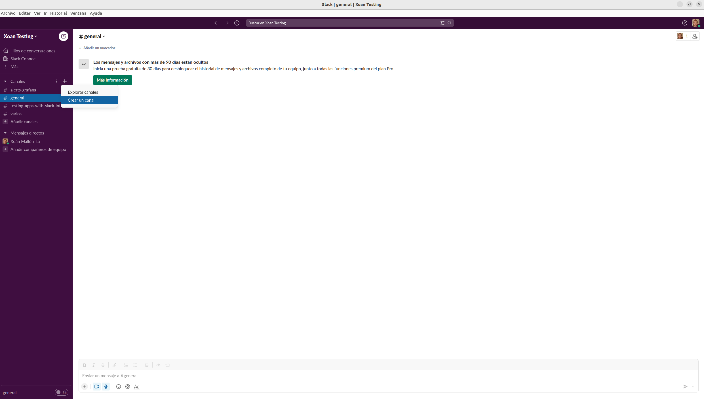
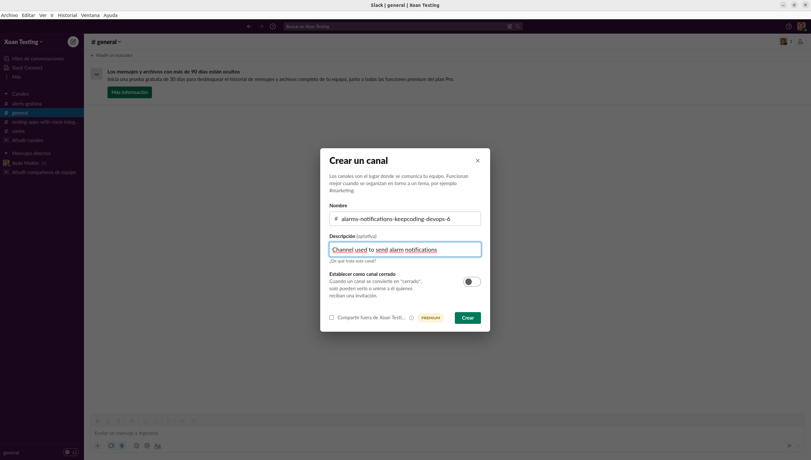
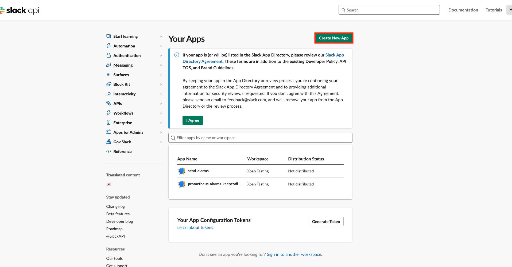
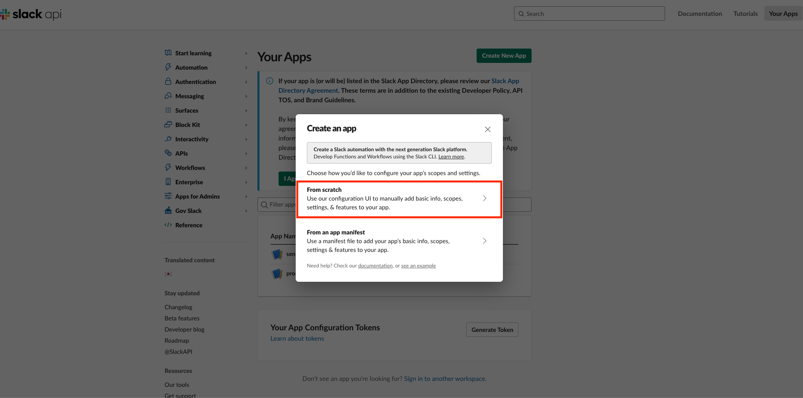
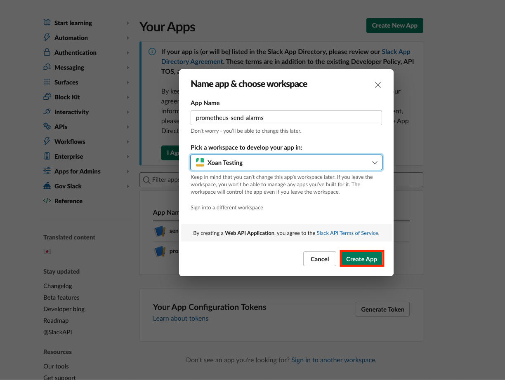
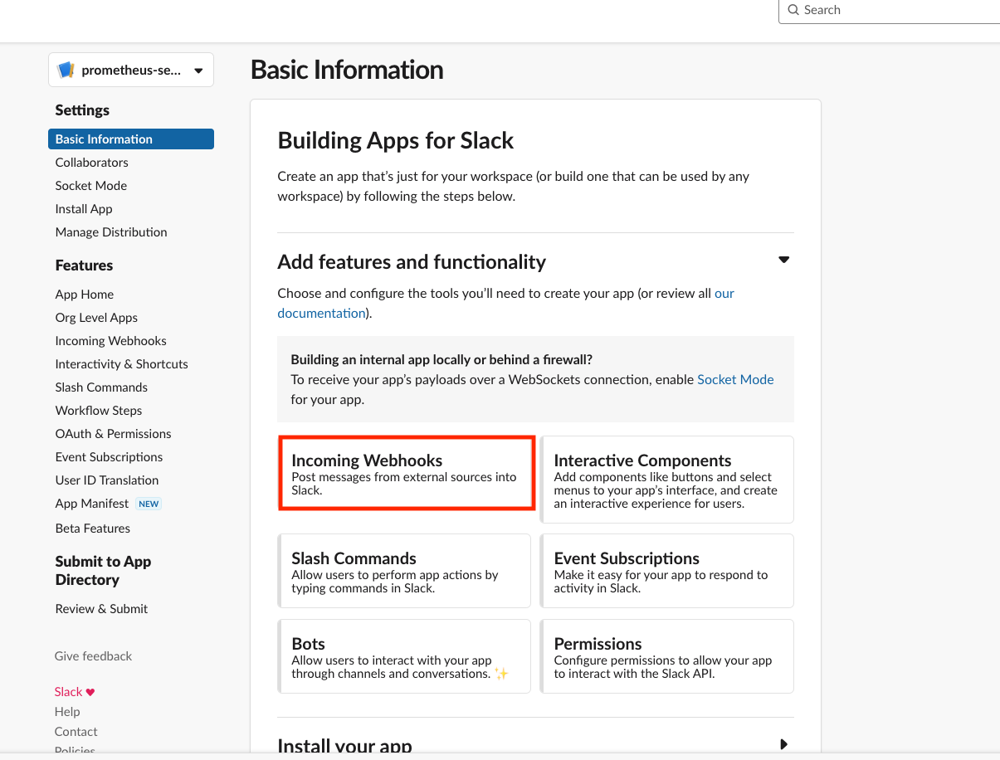
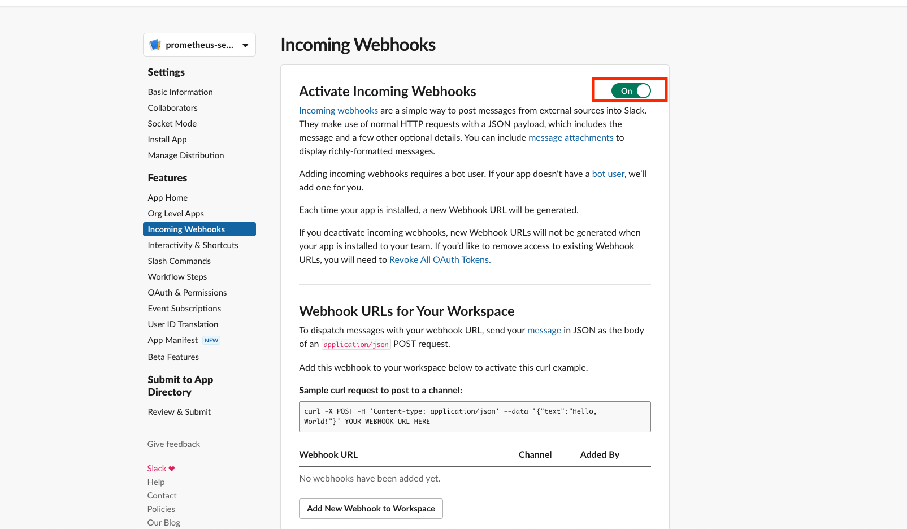
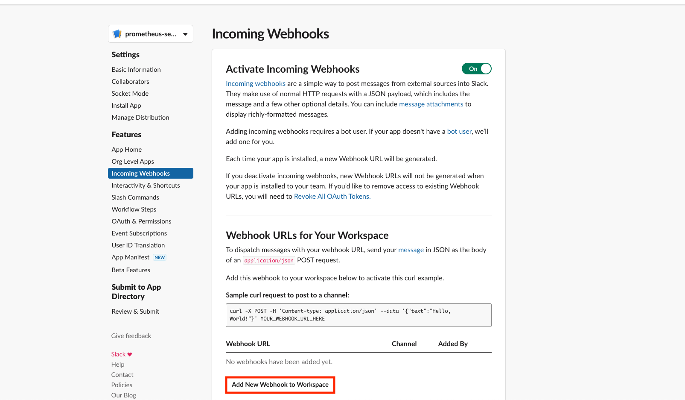
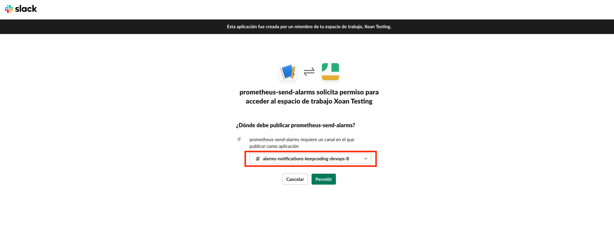
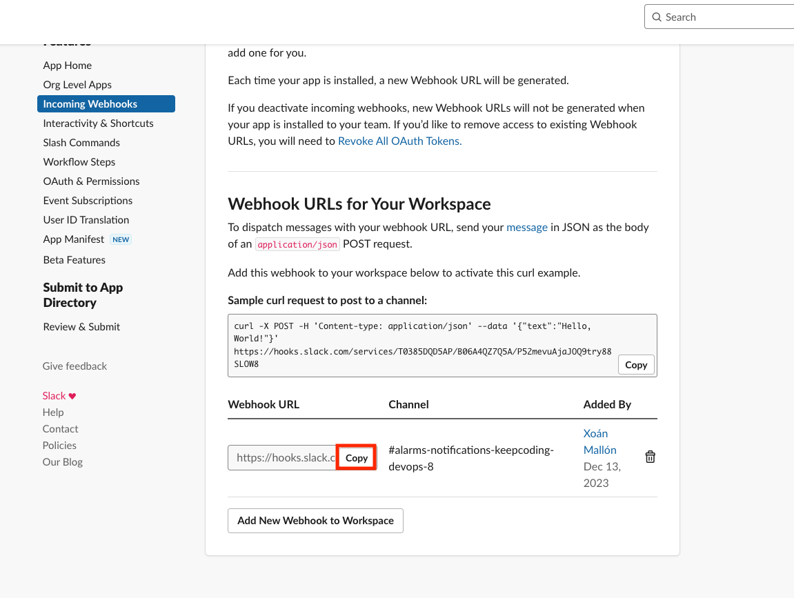

# Monitoring-readme

Pasos para activar el monitoreo por Prometheus de la app.


## Monitoring

- Deployment the Prometheus
- Instalacion de MongoDB exporter
- Slack Alerts
- Grafana Dashboard


## Deployment

Pasos a seguir para la monitorizacion:

Paso 1 - Minikube Cluster

```bash
  minikube start --kubernetes-version='v1.28.3' \
    --cpus=4 \
    --memory=4096 \
    --addons="metrics-server,default-storageclass,storage-provisioner" \
    --nodes 3 -p martian-bank-test-3nodes 
```

```bash
  kubectl label node martian-bank-test-3nodes-m02 node-role.kubernetes.io/worker=worker
    
  kubectl label node martian-bank-test-3nodes-m03 node-role.kubernetes.io/worker=worker

```

```bash
  kubectl label nodes martian-bank-test-3nodes-m02 role=worker
    
  kubectl label nodes martian-bank-test-3nodes-m03 role=worker


```


Paso 2 - Deployment de Prometheus

```bash
helm repo add prometheus-community https://prometheus-community.github.io/helm-charts
helm repo add stable https://charts.helm.sh/stable
helm repo update

```

```bash
helm -n monitoring upgrade \
    --install prometheus \
    prometheus-community/kube-prometheus-stack \
    -f prometheus/values.yaml \
    --create-namespace \
    --wait --version 55.4.0

```

Paso 3 - Deployment de la App

```bash
helm install martianbanktest martianbank-helm-chart
```

Paso 4 - Deployment de MongoDB Exporter

```bash
helm install mongodb-exporter prometheus-community/prometheus-mongodb-exporter -f prometheus/values.yaml
```

Paso 5 - Revisar que los servicios este funcionando

```bash
kubectl port-forward -n monitoring svc/prometheus-kube-prometheus-prometheus 9090:9090

kubectl port-forward -n monitoring svc/prometheus-grafana 3000:80

kubectl port-forward svc/mongodb-exporter-prometheus-mongodb-exporter 9216:9216
```

La contraseña de Grafana , quedo por defecto en "prom-operator"

Paso 6 - Crear canal de Slack

1. Crear un espacio de trabajo de Slack utilizando la [página oficial](https://slack.com/get-started#/createnew)

2. Crear una [aplicación de Slack](https://api.slack.com/apps?new_app=1) para el envío de notificaciones mediante webhook, para poder conectarlo con un canal que se debe crear, para realizar así el envío de las alarmas por parte de AlertManager que se utilizará posteriormente. Para ello desde la aplicación de Slack se deben realizar los siguientes pasos:

    1. Desde la aplicación de Slack se creará un canal para el envío de alarmas, para ello es necesario hacer click en el botón con el símbolo `+` en el panel lateral izquierdo de la sección `Canales`, aparecerá un desplegable con dos opciones, donde se deberá hacer click en la opción `Crear un canal`, tal y como se expone en la siguiente captura.

        

    2. Introducir el nombre para el canal que se utilizará para el envío de notificaciones relacionadas con alarmas,  añadiendo opcionalmente una descripción para el propósito del canal. Se puede ver un ejemplo de esta configuración en la siguiente imagen.

        

    3. Una vez introducidos los datos hacer click en el botón `Crear` de color verde.

    4. Desde la página de creación de la aplicación hacer click en la opción `Create New App`, tal y como se puede ver en la siguiente imagen, donde se ha señalado esta opción mediante un rectángulo de color rojo.

        

    5. Aparacerá una ventana emergente con dos opciones a seleccionar, es necesario escoger aquella que poner `**From scratch**`, tal y como se expone en la siguiente imagen, donde se ha señalado la opción sobre la que es necesario hacer click mediante un rectángulo rojo.

        

    6. Será necesario rellenar la información de la aplicación, indicando un nombre para esta a través de `App Name`, así como el workspace donde se va a instalar a través de la opción `Pick a workspace to develop your app in`, siendo este el workspace creado al inicio de esta sesión. En la siguiente imagen se muestra un ejemplo de esta configuración.

        

    7. Una vez rellenada la información es necesario pulsar sobre el botón `Create App`, indicado en la imagen anterior mediante un rectángulo rojo.

    8. Se redirigirá la página a la configuración de la aplicación, en la sección **Add features and functionality** es necesario hacer click sobre la opción **Incoming Webhooks**. Esta opción se señala de forma clara en la siguiente captura mediante un rectángulo rojo.

        

    9. En el siguiente paso aparecerá una venta con una opción para activar los Incoming Webhooks, para ello será necesario marcar la opción que está inicialmente a `Off` haciendo click en ella para que pase a `On`. Debería quedar algo tal y como lo que se expone en la siguiente captura, donde se señala mediante un rectángulo rojo la opción mencionada.

        

    10. Es necesario crear un nuevo webhook URL, para ello bastará con hacer click sobre la opción **`Add New Webhook to Workspace`**, opción que aparecerá abajo del todo. En la siguiente imagen se señala esta de forma clara mediante un rectángulo rojo.

        

    11. Aparecerá un menú emergente en el que será necesario seleccionar el canal al que enviar los mensajes que lleguen a través del webhook, para ello es necesario escoger el canal de nombre  creado al inicio del laboratorio. Debería quedar por lo tanto algo como lo mostrado en la siguiente captura, donde se señala de forma clara este canal escogido.

        

    12. Escogido el canal es necesario hacer click sobre el botón `Permitir`.

    13. Se redirigirá a la configuración de los webhooks, donde ahora en la sección **Webhook URLs for Your Workspace**, aparecerá un webhook, es necesario copiar la `Webhook URL` para utilizar posteriormente en la configuración de Prometheus. Para ello bastará con hacer click sobre la opción `Copy` de esta. En la siguiente imagen se indica la opción sobre la que habría que hacer click para obtener esta URL.

        

3. Modificar el fichero `prometheus/values.yaml` añadiendo el canal al que se enviarán las alarmas, así como la URL del webhook configurado en el paso anterior.

4. Para utilizar el Webhook creado para esta aplicacion, hay que seguir los siguientes pasos:

    usar envsubst para reemplazar el secreto por la URL de Slack
      Paso 1 - Abrir un Codespace en Github
      Paso 2 - Utilizar el siguiente comando:
      ```bash
      envsubst < values.yaml > rendered-values.yaml
      ```

      Paso 3 - Hacer el deployment de helm con el nuevo rendered-values.yaml
      ```bash
      helm -n monitoring upgrade \
          --install prometheus \
          prometheus-community/kube-prometheus-stack \
          -f prometheus/rendered-values.yaml \
          --create-namespace \
          --wait --version 55.4.0

      ``` 

Paso 7 - Verificar que las alarmas funcionando

Para probar que la alarmad de Mongo DB funciona, desinstalamos la app y vemos como salta una alarma que MongoDB no esta operativo.

Para probar la alarma del uso de memoria de los nodos, creamos un pod para estresar uno de los nodos con el siguiente comando:

```bash
"kubectl run memory-stress \
  --image=polinux/stress \
  --restart=Never \
  -- stress --vm 4 --vm-bytes 1G --timeout 600s"

```