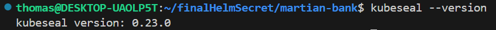
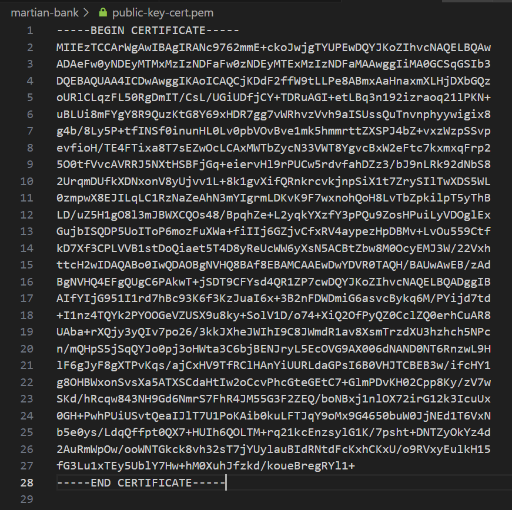
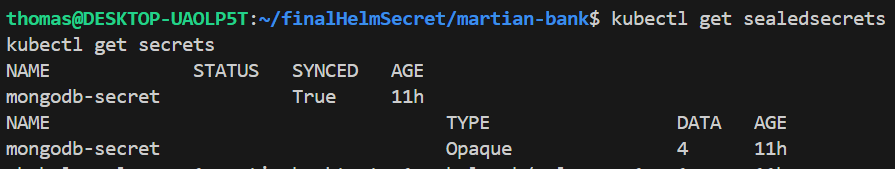

# Sealed Secrets en Kubernetes

## ¿Por qué usar Sealed Secrets?

Sealed Secrets resuelve un problema común en la gestión de configuraciones de Kubernetes: la incapacidad de almacenar secretos de forma segura en repositorios de control de versiones. Con Sealed Secrets, podemos:

1. Encriptar información sensible en SealedSecrets.
2. Almacenar SealedSecrets de forma segura en repositorios públicos.
3. Mantener toda la configuración de Kubernetes, incluidos los secretos, en un sistema de control de versiones.
4. Mejorar la seguridad, ya que solo el controlador en el clúster puede desencriptar los SealedSecrets.

## Instalación y Configuración

Guia Oficial: https://github.com/bitnami-labs/sealed-secrets#installation

Ver Video: [Instalacion y demostracion](videos/sealedsecret.mp4)


### 1. Instalar Sealed Secrets Controller

```bash
helm repo add sealed-secrets https://bitnami-labs.github.io/sealed-secrets
helm repo update
helm install sealed-secrets sealed-secrets/sealed-secrets -n kube-system
```

Verificar la instalación:

```bash
kubectl get pods -n kube-system | grep sealed-secrets
```


### 2. Instalar kubeseal en la máquina local

Para Linux x86_64:

```bash
wget https://github.com/bitnami-labs/sealed-secrets/releases/download/v0.18.1/kubeseal-linux-amd64 -O kubeseal
sudo install -m 755 kubeseal /usr/local/bin/kubeseal
```

Verificar la instalación:

```bash
kubeseal --version
```



### 3. Obtener la clave pública del controlador

```bash
kubeseal --fetch-cert --controller-name=sealed-secrets --controller-namespace=kube-system > public-key-cert.pem
```



## Uso de Sealed Secrets

### 1. Crear un Sealed Secret

Primero, obtén el secreto existente en formato YAML (si ya tienes creado y aplicado el secret, sino pasar al siguiente paso):

```bash
kubectl get secret nombre-del-secret -o yaml > secret.yaml
```

Luego, usa kubeseal para crear el Sealed Secret:

```bash
kubeseal --controller-name=sealed-secrets --controller-namespace=kube-system --format yaml < templates/secret.yaml > templates/sealedsecret.yaml
```

### 2. Aplicar el Sealed Secret

```bash
kubectl apply -f sealed-mongodb-secret.yaml
```
Verificar la creación:

```bash
kubectl get sealedsecrets
kubectl get secrets
```



## Gestión de Archivos

- Mantener: `sealed-secret.yaml`
- Eliminar (si no es necesario): `secret.yaml`
- Eliminar (si no es necesario): `public-key.cert.pem`

## Compartir con el Equipo

Para que un compañero pruebe los Sealed Secrets:

1. Clonar el repositorio y cambiar a la rama correspondiente.
2. Asegurarse de que el controlador de Sealed Secrets esté instalado en su clúster.
3. Crear clave pública del controlador
4. Crear el `sealed-secret.yaml` a traves de la clave y del `secret.yaml`
3. Aplicar el `sealed-secret.yaml` con kubectl.
4. Ejecutar helm install con la configuración actualizada.


# Resumen del Proyecto

## Configuración de MongoDB con Sealed Secrets

1. **Creación del Secret**:
   - Se creó un Secreto de Kubernetes para almacenar las credenciales de MongoDB, incluyendo el nombre de usuario, contraseña y host.

2. **Implementación de Sealed Secrets**:
   - Se implementó Sealed Secrets para encriptar secretos sensibles, permitiendo almacenar las credenciales de forma segura en un repositorio de código.

3. **Generación del SealedSecret**:
   - Se generó un archivo sealed-mongodb-secret.yaml que contiene el SealedSecret encriptado para garantizar que las credenciales no se expongan en texto plano.

4. **Aplicación del SealedSecret**:
   - Se aplicó el SealedSecret al clúster de Kubernetes, creando automáticamente un Secreto estándar a partir de él.

5. **Verificación del Funcionamiento**:
   - Se verificó que el pod de MongoDB se inició correctamente y está escuchando en el puerto apropiado, indicando que está listo para operar.

6. **Configuración de Helm**:
   - Los valores de configuración (nombre de usuario, contraseña y host) se mantuvieron en el archivo values.yaml, permitiendo una gestión de credenciales más fácil y flexible.

## Resultados

- La instancia de MongoDB está funcionando correctamente y lista para aceptar conexiones.
- Se ha implementado una solución segura para la gestión de secretos utilizando Sealed Secrets.
