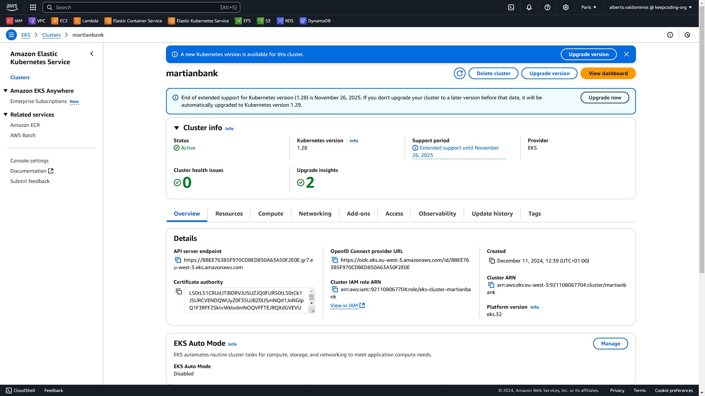

# Cluster EKS en AWS con Terraform 

## Guía para Ejecutar Código Terraform en la Carpeta `/martianbank-terraform`

Este documento proporciona instrucciones detalladas para configurar y ejecutar código Terraform dentro de la carpeta `/martianbank-terraform`.

## Requisitos Previos

Antes de comenzar, asegúrate de tener los siguientes requisitos cumplidos:

1. **Terraform instalado**: Descárgalo desde [la página oficial de Terraform](https://www.terraform.io/downloads).
2. **Credenciales configuradas**: Si estás utilizando un proveedor en la nube como AWS, [AWS CLI](https://docs.aws.amazon.com/cli/latest/userguide/getting-started-install.html) con las credenciales configuradas correctamente.
3. **Acceso a la terminal**: Necesitarás un entorno de línea de comandos (CLI) para ejecutar los comandos.

## Instrucciones Paso a Paso

1. **Clona o copia el repositorio**  
   Si el código no está en tu máquina, clona el repositorio o copia los archivos en tu sistema.  
   ```bash
   git clone https://github.com/devopsx-keepcoding/martian-bank.git
   cd martianbank-terraform
   ```

2. **Inicializa el entorno de Terraform**

    Ejecuta el siguiente comando dentro de la carpeta /martianbank-terraform para inicializar los plugins y configuraciones necesarias:
   ```bash
   terraform init
   ```

3. **Previsualiza los cambios**

    Para verificar qué cambios realizará Terraform, ejecuta el siguiente comando:
   ```bash
   terraform plan
   ```
    Este comando muestra una lista de las acciones que se ejecutarán sin realizar ningún cambio real.

4. **Aplica los cambios**

    Una vez que estés seguro de los cambios a realizar, aplica el plan ejecutando:
   ```bash
   terraform apply
   ```
   Terraform te pedirá confirmación antes de ejecutar los cambios. Escribe yes para continuar.

5. **Verifica los recursos**

   Después de aplicar los cambios, puedes verificar el estado de los recursos con:
   ```bash
   terraform show
   ```
   Puedes comprobar el estado del cluster creado en la interfaz grafica de AWS


    En la terminal ejecuta el siguiente comando para añadir el cluster creado al archivo kubeconfig local y poder interactuar con el cluster mediante `kubectl`.

    ```bash
    aws eks update-kubeconfig --name martianbank --region eu-west-3
    ```

    Para asegurar que tienes acceso al cluster, ejecuta el siguiente comando 
    
    ```bash
    kubectl get nodes
    ```

    Deberias ver una entrada similar a:
        
    ```bash
    NAME                                        STATUS   ROLES    AGE   VERSION
    ip-10-0-13-5.eu-west-3.compute.internal     Ready    <none>   64m   v1.28.15-eks-59bf375
    ip-10-0-46-227.eu-west-3.compute.internal   Ready    <none>   66m   v1.28.15-eks-59bf375
    ```


6. **Destruye los recursos (si es necesario)**

    Si necesitas eliminar los recursos creados, usa el siguiente comando:
    ```bash
    terraform destroy
    ```


## Instalación de la aplicación `MartianBank` mediante el chart de helm.

Ejecuta el siguiente comando fuera de la carpeta /martianbank-helm-chart para instalar la aplicación mediante el chart de helm:
```bash
helm install martianbank martianbank-helm-chart/
```

Espera a que todos los recursos esten disponibles. Ejecuta: 
 
```bash
kubectl get svc nginx
```
Deberias ver una entrada similar a:

```bash
NAME    TYPE           CLUSTER-IP       EXTERNAL-IP                                                                     PORT(S)        AGE
nginx   LoadBalancer   172.20.107.219   ac1b4668a3db84f2892fdbbafec1c958-46a4afa25103a8a0.elb.eu-west-3.amazonaws.com   80:32640/TCP   13m
```
Asegurate que el load balancer esta activo. Puedes comprobar el estado en la interfaz grafica de AWS


Copia la dirección dns de EXTERNAL-IP del servicio `nginx` y accede a ella desde tu navegador. Puedes ver un [video del despliegue de la aplicación](./videos/terraform-01.mp4). 